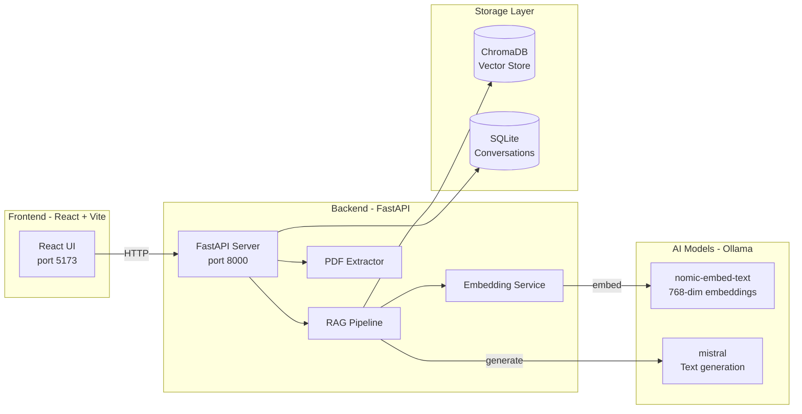
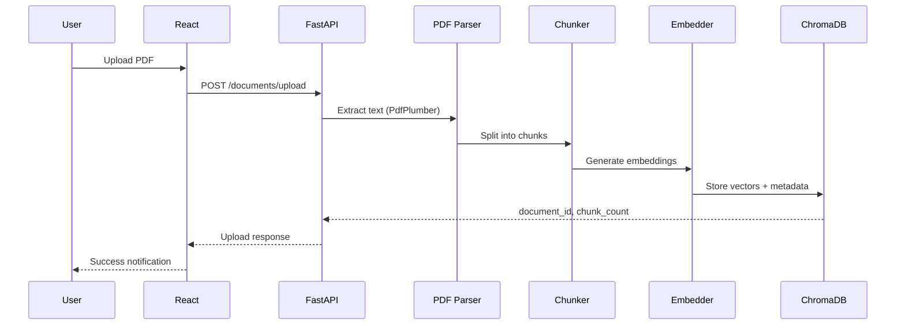
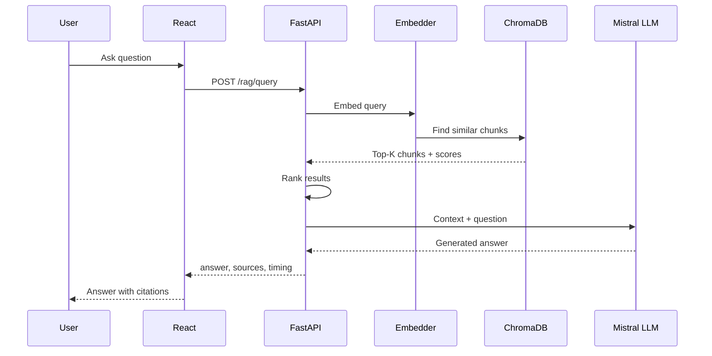

<h1 align="center">📄 Document Agent</h1>

<p align="center">
  <strong>AI-Powered Document Search & Chat Platform</strong>
</p>

<p align="center">
  
  
  
  
  
  
</p>

<p align="center">
  Upload PDFs · Semantic Search · Chat with Documents · RAG-Powered Answers · All Local
</p>

---

## 📖 Overview

Document Agent transforms PDF documents into a searchable, queryable knowledge base. Upload PDFs and the system automatically extracts text, generates vector embeddings, and stores them for semantic retrieval. Ask questions in natural language and get AI-powered answers with source citations — **all running locally with zero cloud dependencies**.

---

## ✨ Features

<table>
<tr>
<td width="50%">

### 📁 Document Management
- 📤 PDF upload with drag-and-drop
- 📑 Intelligent text extraction (PdfPlumber + PyPDF fallback)
- ✂️ Smart chunking (500 words, 100 overlap)
- 🔍 Duplicate detection via SHA256 hashing
- 🔄 Reindex, cleanup, and health checks

</td>
<td width="50%">

### 🤖 AI Capabilities
- 💬 RAG query — answers with source citations
- 🗣️ Multi-turn chat with document context
- 📝 Document summarization
- ⚡ SSE streaming (token-by-token)

</td>
</tr>
<tr>
<td>

### 🔎 Search & Retrieval
- 🧠 Semantic vector search
- 🏷️ Metadata filtering (company, year, department)
- 📊 Configurable similarity thresholds
- 💾 Response caching with TTL

</td>
<td>

### 🏗️ Infrastructure
- 💾 SQLite conversation persistence
- 🔄 Startup auto-sync with ChromaDB
- 🧹 Orphan chunk cleanup
- 🌐 Full CORS support

</td>
</tr>
</table>

---

## 🛠️ Tech Stack

| Layer | Technology | Purpose |
|-------|------------|---------|
| 🐍 **Backend** | Python 3.12, FastAPI, Uvicorn | REST API server |
| 🧮 **Vector DB** | ChromaDB (cosine distance) | Vector storage & retrieval |
| 🔢 **Embeddings** | Ollama — `nomic-embed-text` (768-dim) | Text → vector conversion |
| 🧠 **LLM** | Ollama — `mistral` | Text generation & reasoning |
| 📄 **Text Processing** | LangChain, PdfPlumber, PyPDF | PDF extraction & chunking |
| 🗄️ **Database** | SQLAlchemy + SQLite | Conversation persistence |
| ⚛️ **Frontend** | React 19, Vite 8, Tailwind CSS 3 | User interface |
| 🧭 **Routing** | React Router 7 | Client-side navigation |
| 🌐 **HTTP** | httpx (backend), Fetch API (frontend) | API communication |

---

## 🏛️ Architecture

### System Overview



### 📤 Ingestion Flow



### 🔍 Query Flow (RAG)



---

## 📋 Prerequisites

| Requirement | Version | Install |
|-------------|---------|---------|
| 🐍 Python | 3.12+ | [python.org](https://python.org) |
| 📦 Node.js | 18+ | [nodejs.org](https://nodejs.org) |
| 🧠 Ollama | Latest | [ollama.ai](https://ollama.ai) |

---

## 🚀 Quick Start

### 1️⃣ Install Ollama Models

```bash
ollama pull nomic-embed-text   # 🔢 Embeddings (768-dim)
ollama pull mistral            # 🧠 LLM for text generation
```

### 2️⃣ Backend Setup

```bash
cd backend

# Create virtual environment
python -m venv venv
source venv/bin/activate        # Linux / macOS
# venv\Scripts\activate         # Windows

# Install dependencies
pip install -r requirements.txt

# Configure (optional — defaults work out of the box)
cp .env.example .env

# Start the server
python -m uvicorn main:app --reload --host 0.0.0.0 --port 8000
```

📖 API documentation: **http://localhost:8000/docs**

### 3️⃣ Frontend Setup

```bash
cd frontend/document-agent-ui

# Install dependencies
npm install

# Start development server
npm run dev
```

🌐 Open **http://localhost:5173**

---

## ⚙️ Configuration

Backend configuration lives in `backend/config.yaml`. Environment variables (`.env`) override these values.

<table>
<tr><th>🔤 Embeddings</th><th>🧠 LLM / RAG</th></tr>
<tr>
<td>

| Key | Default | Description |
|-----|---------|-------------|
| `embeddings.model` | `nomic-embed-text` | Embedding model |
| `embeddings.dimension` | `768` | Vector dimension |
| `embeddings.timeout` | `60` | Timeout (seconds) |
| `embeddings.cache_embeddings` | `true` | Enable cache |

</td>
<td>

| Key | Default | Description |
|-----|---------|-------------|
| `rag.generator.model` | `mistral` | LLM model |
| `rag.generator.temperature` | `0.7` | Generation temperature |
| `rag.generator.max_tokens` | `500` | Max output tokens |
| `rag.generator.timeout_seconds` | `120` | Generation timeout |
| `rag.retriever.k` | `5` | Chunks per query |
| `rag.cache.ttl_seconds` | `3600` | Cache TTL |

</td>
</tr>
<tr><th>✂️ Chunking</th><th>🗄️ Storage</th></tr>
<tr>
<td>

| Key | Default | Description |
|-----|---------|-------------|
| `chunking.strategy` | `recursive` | Chunking strategy |
| `chunking.chunk_size` | `500` | Words per chunk |
| `chunking.chunk_overlap` | `100` | Overlap words |

</td>
<td>

| Key | Default | Description |
|-----|---------|-------------|
| `chromadb.collection_name` | `company_documents` | Collection name |
| `chromadb.distance_metric` | `cosine` | Distance metric |
| `database.url` | `sqlite:///./data/chat.db` | SQLite path |

</td>
</tr>
</table>

See `backend/.env.example` for all environment variables.

Frontend: set `VITE_API_URL` to change the backend URL (default `http://localhost:8000`).

---

## 📡 API Endpoints

<table>
<thead>
<tr><th>Method</th><th>Path</th><th>Description</th></tr>
</thead>
<tbody>
<tr><td colspan="3"><strong>🏥 Health</strong></td></tr>
<tr><td><code>GET</code></td><td><code>/</code></td><td>Root — app info & docs link</td></tr>
<tr><td><code>GET</code></td><td><code>/health</code></td><td>Health check</td></tr>

<tr><td colspan="3"><strong>📁 Documents</strong></td></tr>
<tr><td><code>POST</code></td><td><code>/documents/upload</code></td><td>Upload a PDF</td></tr>
<tr><td><code>GET</code></td><td><code>/documents</code></td><td>List all documents</td></tr>
<tr><td><code>DELETE</code></td><td><code>/documents/{id}</code></td><td>Delete a document</td></tr>
<tr><td><code>POST</code></td><td><code>/documents/reindex/{id}</code></td><td>Reindex a document</td></tr>
<tr><td><code>GET</code></td><td><code>/documents/stats</code></td><td>System statistics</td></tr>
<tr><td><code>POST</code></td><td><code>/documents/cleanup</code></td><td>Remove orphaned chunks</td></tr>
<tr><td><code>GET</code></td><td><code>/documents/health</code></td><td>Document store health</td></tr>

<tr><td colspan="3"><strong>🔎 Search</strong></td></tr>
<tr><td><code>POST</code></td><td><code>/search</code></td><td>Semantic search</td></tr>

<tr><td colspan="3"><strong>🧠 RAG</strong></td></tr>
<tr><td><code>POST</code></td><td><code>/rag/query</code></td><td>Question answering with sources</td></tr>
<tr><td><code>POST</code></td><td><code>/rag/chat</code></td><td>Multi-turn chat</td></tr>
<tr><td><code>POST</code></td><td><code>/rag/summarize</code></td><td>Document summarization</td></tr>
<tr><td><code>POST</code></td><td><code>/rag/stream</code></td><td>Streaming response (SSE)</td></tr>

<tr><td colspan="3"><strong>💬 Conversations</strong></td></tr>
<tr><td><code>GET</code></td><td><code>/conversations</code></td><td>List conversations</td></tr>
<tr><td><code>POST</code></td><td><code>/conversations</code></td><td>Create conversation</td></tr>
<tr><td><code>GET</code></td><td><code>/conversations/{id}</code></td><td>Get conversation + messages</td></tr>
<tr><td><code>PATCH</code></td><td><code>/conversations/{id}</code></td><td>Update title</td></tr>
<tr><td><code>DELETE</code></td><td><code>/conversations/{id}</code></td><td>Delete conversation</td></tr>
</tbody>
</table>

📖 Full schemas: **http://localhost:8000/docs**

---

## 📂 Project Structure

```
document-agent/
├── 📄 README.md
│
├── 🐍 backend/
│   ├── main.py                     # 🚀 FastAPI entry point
│   ├── config.yaml                 # ⚙️ Configuration
│   ├── requirements.txt            # 📦 Python dependencies
│   ├── app/
│   │   ├── api/                    # 📡 Route definitions
│   │   │   ├── routes.py           #    Document endpoints
│   │   │   ├── search.py           #    Search endpoint
│   │   │   ├── rag.py              #    RAG (query, chat, summarize, stream)
│   │   │   ├── conversations.py    #    Conversation CRUD
│   │   │   └── deps.py             #    Dependency injection
│   │   ├── models/                 # 📋 Schemas + DB models
│   │   ├── services/               # 🔧 Business logic
│   │   ├── rag/                    # 🧠 RAG pipeline
│   │   │   ├── pipeline.py         #    Orchestrator
│   │   │   ├── retriever.py        #    Vector retrieval
│   │   │   ├── generator.py        #    LLM generation
│   │   │   ├── ranker.py           #    Result ranking
│   │   │   └── cache.py            #    Response cache
│   │   ├── embeddings/             # 🔢 Ollama embedding client
│   │   ├── vector_store/           # 💾 ChromaDB service
│   │   ├── pdf/                    # 📄 PDF text extraction
│   │   ├── chunking/               # ✂️ Text chunking
│   │   └── utils/                  # 🛠️ Config, logger, validators
│   └── tests/                      # 🧪 Unit & integration tests
│
└── ⚛️ frontend/
    └── document-agent-ui/
        ├── package.json            # 📦 Node dependencies
        ├── src/
        │   ├── App.jsx             # 🧭 Routes
        │   ├── pages/              # 📄 Dashboard, Documents, Search, Query, Chat, Summarize
        │   ├── components/         # 🧩 UI components, layout, chat
        │   ├── services/api/       # 🌐 API client modules
        │   ├── hooks/              # 🪝 Custom React hooks
        │   ├── stores/             # 🗄️ State management
        │   ├── config/             # ⚙️ Constants & endpoints
        │   └── utils/              # 🛠️ Formatters, validators
        └── docs/                   # 📖 Frontend documentation
```

---

## 🧪 Development

```bash
# Backend — run tests
cd backend
python -m pytest tests/ -v

# Frontend — lint & format
cd frontend/document-agent-ui
npm run lint
npm run format

# Frontend — production build
npm run build
```

---

## 📄 License

MIT
